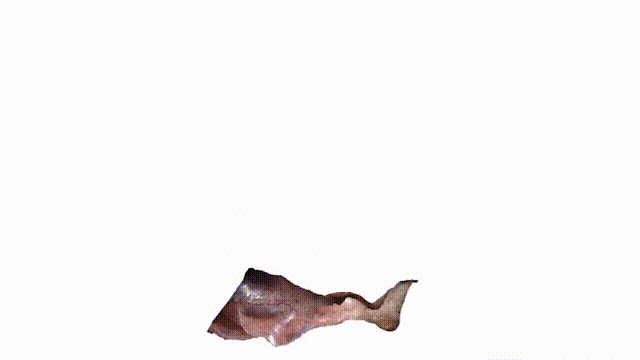

# Stereo Correspondence and Reconstruction of Endoscopic Data Challenge

This is a project about the "Stereo Correspondence and Reconstruction of Endoscopic Data Challenge", which includes data download and processing, the implementation of multiple stereo matching models, and the depth estimation(reconstruction) results display.

# How to use

## Environment
* python 3.9
* Pytorch '1.10.2+cu111'

## Data Preparation
#### Download 
Download SCARED Dataset from [SCARED Datasets](https://endovissub2019-scared.grand-challenge.org/)
#### Preprocessing
Run the script `./scripts/preprocessing.sh` to unzip, extract images from video, rectify the images and ground truth.Note that you can rectify the images only, but need reverse the rectify from the predicted(rectified) to original(unrectified).

Run the script `./scripts/get_csv.sh` to get a .csv file which contains and organizes the path information of the necessary data.By default the .csv files will saved to `./csvfiles`.

## Training
Here are five available models,you can choose one of them`['stackhourglass', 'basic', 'constancy', 'gwc_g', 'gwc_gc']` by set the `--model` argument in the `./scripts/train.sh`.Remember update other command arguments.

Run the script `./scripts/train.sh` to train the model you choose on the SCARED dataset.

## Evaluation
Run the script `./scripts/test.sh`  to evaluate the predictions, remember specify a savedir to store the results.  

# Representation
The details of `basic` and `stackhourglass`model can be found in "Pyramid Stereo Matching Network".

The `constancy` means using feature constancy as a loss term,and the `gwc_g` and `gwc_gc`means using group-wise correlation to build the cost volume.

The depth estimation of the `stackhourglass`, `constancy`, `gwc_gc` and the reconstructed surface are shows as below:

​                                                         

